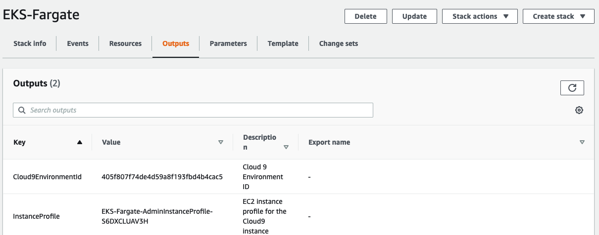
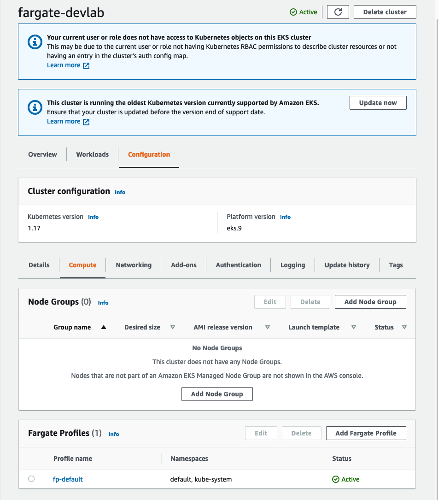

## Using ALB Ingress Controller with Amazon EKS on Fargate

This lab is provided as part of **[AWS Innovate Modern Applications Edition](https://aws.amazon.com/events/aws-innovate/modern-apps/)**, click [here]() to explore the full list of hands-on labs.

ℹ️ You will run this lab in your own AWS account. Please follow directions at the end of the lab to remove resources to avoid future costs.

**Time**: ~ 1 hour.  
**Mandatory Requirement**: AWS Account with Admin access

### About this lab
[AWS Fargate](https://docs.aws.amazon.com/eks/latest/userguide/fargate.html) is a technology that provides on-demand, right-sized compute capacity for containers. With AWS Fargate, you no longer have to provision, configure, or scale groups of virtual machines to run containers. This removes the need to choose server types, decide when to scale your node groups, or optimize cluster packing. You can control which pods start on Fargate and how they run with [Fargate profiles](https://docs.aws.amazon.com/eks/latest/userguide/fargate-profile.html), which are defined as part of your Amazon EKS cluster.

In this lab, we will deploy a replica set of NGINX pods on EKS Fargate.


## Setup

### Step 1 - Create Cloud9 environment via AWS CloudFormation

1. Log in your AWS Account
1. Click [this link](https://console.aws.amazon.com/cloudformation/home?region=us-east-1#/stacks/new?stackName=EKS-Fargate&templateURL=https://aws-innovate-modern-applications.s3.amazonaws.com/eks-fargate/cloud9.yaml) and open a new browser tab
1. Click *Next* again to the stack review page, tick **I acknowledge that AWS CloudFormation might create IAM resources** box and click *Create stack*.
  
  

4. Wait for a few minutes for stack creation to complete.
5. Select the stack and note down the outputs (*Cloud9EnvironmentId* & *InstanceProfile*) on *outputs* tab for next step.

  

### Step 2 - Assign instance role to Cloud9 instance

1. Launch [AWS EC2 Console](https://console.aws.amazon.com/ec2/v2/home?#Instances).
2. Use stack output value of *Cloud9EnvironmentId* as filter to find the Cloud9 instance.

  

3. Right click the instance, *Security* -> *Modify IAM Role*.
4. Choose the profile name matches to the *InstanceProfile* value from the stack output, and click *Apply*.

  

### Step 3 - Disable Cloud9 Managed Credentials

1. Launch [AWS Cloud9 Console](https://console.aws.amazon.com/cloud9/home?region=us-east-1#)
1. Locate the Cloud9 environment created for this lab and click "Open IDE". The environment title should start with *EKSCloud9*.
1. At top menu of Cloud9 IDE, click *AWS Cloud9* and choose *Preferences*.
1. At left menu *AWS SETTINGS*, click *Credentials*.
1. Disable AWS managed temporary credentials:

  

### Step 4 - Bootstrap lab environment on Cloud9 IDE

Run commands below on Cloud9 Terminal to clone this lab repository and bootstrap the lab:

```
git clone https://github.com/phonghuule/eks-fargate.git
cd eks-fargate
./bootstrap.sh
```

The *bootstrap.sh* script will:

- Upgrade AWS CLI to latest version.
- Install kubectl, [eksctl](https://eksctl.io/).
- Create an EKS cluster with eksctl.
- Set up [IAM roles for service accounts](https://docs.aws.amazon.com/eks/latest/userguide/iam-roles-for-service-accounts.html) for ALB Ingress Controller.

  

Note: If the script is stuck at creating SSH Key Pair, please hit enter, the script will continue

## Lab
### Step 1 - Launch The EKS Fargate Cluster Using eksctl
In Cloud 9 environment, open the Terminal, and run the following command:

    eksctl create cluster --name=fargate-devlab --alb-ingress-access --region=${AWS_REGION} --fargate --version 1.17

**[Note: Spinning the cluster can take up to 15 minutes]**

Go to the [AWS console → Services → EKS](https://console.aws.amazon.com/eks/home?region=us-east-1#/clusters) and see the cluster that’s been created. 
You’ll see that there’s a Fargate profile created by default, since we used the “—fargate” flag when using eksctl. One more thing you’ll note is that there are no EC2 instances and that’s because again, we used the "fargate" flag when configuring the EKS cluster with eksctl.
. 

Now issue the kubectl get pods command:

    kubectl get pods
    
Expected Output:
```
  **No resources found**.
```

As expected, you won’t see any pods since we haven’t spun up anything. 
If you go in the [EC2 console](https://console.aws.amazon.com/ec2/v2/home?region=us-east-1#Instances:instanceState=running), you won’t see any instances, however when you execute the command:
```
  kubectl get nodes
```

Output: 
```
NAME STATUS ROLES AGE VERSION
fargate-ip-192-168-81-162.ec2.internal Ready <none> 3h17m v1.14.8-eks
fargate-ip-192-168-91-32.ec2.internal Ready <none> 3h18m v1.14.8-eks
```

**Why do we see nodes show up when we haven’t even spun up any pods yet?** [Try to guess before you read the explanation below]

That’s because when we launch EKS cluster with fargate profile, coredns pods are launched by default in the **kube-system namespace**. These coredns pods are ALSO launched as Fargate pods. What’s the proof? the fact that you don’t see any EC2 instances in your console. You can see these pods by issuing the command:
```
kubectl get pods -A
```

Expected Output:
```
NAMESPACE NAME READY STATUS RESTARTS AGE
kube-system coredns-7dc94799cb-7gjfb 1/1 Running 0 3h21m
kube-system coredns-7dc94799cb-h2z2t 1/1 Running 0 3h21m
```

### Step 2 - Create a Fargate profile ###

The [Fargate profile](https://docs.aws.amazon.com/eks/latest/userguide/fargate-profile.html) allows an administrator to declare which pods run on Fargate. Each profile can have up to five selectors that contain a namespace and optional labels. You must define a namespace for every selector. The label field consists of multiple optional key-value pairs. Pods that match a selector (by matching a namespace for the selector and all of the labels specified in the selector) are scheduled on Fargate.

It is generally a good practice to deploy user application workloads into namespaces other than kube-system or default so that you have more fine-grained capabilities to manage the interaction between your pods deployed on to EKS. You will now create a new Fargate profile named applications that targets all pods destined for the `fargate` namespace.

Even though we have created a “fp-default” Fargate profile, we’ll go and create a new profile by the name “**applications**”. 

    eksctl create fargateprofile --cluster fargate-devlab --name applications --namespace fargate

> Fargate profiles are immutable. However, you can create a new updated profile to replace an existing profile and then delete the original after the updated profile has finished creating


Now go to the console and you’ll see a new “**applications**” Fargate profile being created. Creation may take a few minutes or so.


When your EKS cluster schedules pods on Fargate, the pods will need to make calls to AWS APIs on your behalf to do things like pull container images from Amazon ECR. The **Fargate Pod Execution Role** provides the IAM permissions to do this. *This IAM role is automatically created for you by the above command.*

Creation of a Fargate profile can take up to several minutes. 
Execute the following command after the profile creation is completed: 

```
eksctl get fargateprofile --cluster fargate-devlab -o yaml`
```

and you should see output similar to what is shown below:

```
- name: applications
  podExecutionRoleARN: arn:aws:iam::<accountid>:role/eksctl-eksworkshop-eksctl-FargatePodExecutionRole-CF3UGBT88KFO
  selectors:
  - namespace: fargate
  subnets:
  - subnet-0579aa2d5be6e27d8
  - subnet-066de84c2de90b8da
- name: fp-default
  podExecutionRoleARN: arn:aws:iam::<accountid>:role/eksctl-eksworkshop-eksctl-FargatePodExecutionRole-CF3UGBT88KFO
  selectors:
  - namespace: default
  - namespace: kube-system
  subnets:
  - subnet-0579aa2d5be6e27d8
  - subnet-066de84c2de90b8da
```

Notice that the profile includes the private subnets in your EKS cluster. **Pods running on Fargate are not assigned public IP addresses, so only private subnets (with no direct route to an Internet Gateway) are supported when you create a Fargate profile.** Hence, while provisioning an EKS cluster, you must make sure that the VPC that you create contains one or more private subnets. When you create an EKS cluster with [eksctl](http://eksctl.io/) utility (which is what we used), under the hoods it creates a VPC that meets these requirements.

### Step 3 - Deploying Pods to Fargate ###

Lets look at the content of the nginx-deployment.yaml file before we spin up the pods, execute the commands below:

```
cd ~/environment/eks-fargate
cat nginx-deployment.yaml 
```
It should look like this:

```
---
apiVersion: v1
kind: Namespace
metadata:
  name: fargate

---
apiVersion: apps/v1
kind: Deployment
metadata:
  name: nginx-app
  namespace: fargate **<-- NAMESPACE IS FARGATE**
spec:
  replicas: 2 **<-- 2 CONTAINERS WILL BE SPUN UP**
  selector:
    matchLabels:
      app: nginx
  template:
    metadata:
      labels:
        app: nginx
    spec:
      containers:
        - name: nginx
          image: nginx:latest
          imagePullPolicy: Always
          ports:
            - containerPort: 80
              name: http
              protocol: TCP

---
apiVersion: v1
kind: Service **<-- NGINX service is also being spun up**
metadata:
  name: nginx-svc
  namespace: fargate
  annotations:
    alb.ingress.kubernetes.io/target-type: ip
spec:
  sessionAffinity: None
  type: NodePort
  ports:
  - port: 80
    protocol: TCP
    targetPort: 80
  selector:
    app: nginx
```

**Now apply this deployment:**
```
kubectl apply -f nginx-deployment.yaml
```

Check Status (wait till the pods are in *Running* status):
```
kubectl get pods -n fargate -w
```
The first time the pods start, they do take some time due to the “cold start” of fargate pods. Once the pods are in “Ready” status, you can type “ctrl+c”.

Execute the command:
```
kubectl get pods -n fargate
```

Expected Output:
```
NAME READY STATUS RESTARTS AGE
nginx-app-57d5474b4b-cjbmq 1/1 Running 0 88s
nginx-app-57d5474b4b-sf6w7 1/1 Running 0 88s
```
-n — Flag indicates you want to see pods in the fargate namespace. 
If you were to do just ‘kubectl get pods’, you won’t see any pods show up since 
that’s only looking at pods in the default namespace. 

```    
kubectl get service -n fargate -o wide
```
```
NAME TYPE CLUSTER-IP EXTERNAL-IP PORT(S) AGE SELECTOR
nginx-svc NodePort 10.100.33.138 <none> 80:30541/TCP 7m7s app=nginx
```    

The deployment for ngnix we deployed creates a service of type NodePort. 
**Now issue:**
```
kubectl get nodes
```

What do you see? 
```
NAME                                     STATUS   ROLES    AGE    VERSION
fargate-ip-192-168-77-249.ec2.internal   Ready    <none>   101s   v1.14.8-eks
fargate-ip-192-168-79-85.ec2.internal    Ready    <none>   83s    v1.14.8-eks
fargate-ip-192-168-81-162.ec2.internal   Ready    <none>   81m    v1.14.8-eks
fargate-ip-192-168-91-32.ec2.internal    Ready    <none>   81m    v1.14.8-eks
```

As you notice, now we see 4 nodes show up, 2 for the coredns pods and two for the nginx containers we have spun up. These are merely kubelets from the microVMs in which your NGINX pods are running under Fargate, posing as nodes to the EKS Control Plane. This is how the EKS Control Plane stays aware of the Fargate infrastructure under which the pods it orchestrates are running. There will be a “fargate” node added to the cluster for each pod deployed on Fargate.

Go to the AWS Console in the EC2 tab and you’ll still not see any nodes provisioned:


Shows the totally serverless nature of EKS Fargate  


### Step 4 - Test The Service ###

Now lets do a curl on the service by going into one of the pods and ensure we can hit the service from the pods. Here are the service details:

Run:
```
kubectl get service -n fargate -o wide
```
Make sure you note down the **IP Address** of the NodePort. 
```
NAME TYPE CLUSTER-IP EXTERNAL-IP PORT(S) AGE SELECTOR
nginx-svc NodePort 10.100.1.116 <none> 80:31237/TCP 93s app=nginx
```

```
kubectl get pods -n fargate
```

Note down the name of one of the fargate pods. In my case, it was **nginx-app-57d5474b4b-cjbmq**. Yours will be different. 

Execute command (remeber to input your POD name)

`kubectl exec -it <YOUR-NGINX-POD-NAME> -n fargate  /bin/bash`

This should get you directly inside the pod, your prompt should change to something like: **root@nginx-app-XXXX**

Note down the IP of the service that we issued in the command above.. In our case, it is 10.100.1.116. We’ll curl on this IP:

```
root@nginx-app-57d5474b4b-vcnnk:/# curl 10.100.1.116
```

You’ll see the nginx page show up. 

```       
<!DOCTYPE html>
<html>
<head>
<title>Welcome to nginx!</title>
<style>
    body {
        width: 35em;
        margin: 0 auto;
        font-family: Tahoma, Verdana, Arial, sans-serif;
    }
</style>
</head>
<body>
<h1>Welcome to nginx!</h1>
<p>If you see this page, the nginx web server is successfully installed and
working. Further configuration is required.</p>

<p>For online documentation and support please refer to
<a href="http://nginx.org/">nginx.org</a>.<br/>
Commercial support is available at
<a href="http://nginx.com/">nginx.com</a>.</p>

<p><em>Thank you for using nginx.</em></p>
</body>
</html>
```

Now **exit** the pod before doing the cleanup by running:
```
exit
``` 

## Clean Up

Please follow these steps in order to ensure all your resources used are deleted after you complete the lab. 

### Step 1
Run *cleanup.sh* from Cloud 9 Terminal to delete EKS cluster and its resources. Cleanup script will:

- Delete all the resources installed in previous steps.
- Delete the EKS cluster created via bootstrap script.
```
cd ~/environment/eks-fargate/setup
./cleanup.sh
```

### Step 2

Double check the EKS Cluster stack created by eksctl was deleted:

- Launch [AWS CloudFormation Console](https://console.aws.amazon.com/cloudformation/home)
- Check if the stack **eksctl-fargate-devlab-cluster** still exists.
- If exists, click this stack, in the stack details pane, choose *Delete*.
- Select *Delete* stack when prompted.

### Step 3

Delete the Cloud 9 CloudFormation stack named **EKS-Fargate** from AWS Console:

- Launch [AWS CloudFormation Console](https://console.aws.amazon.com/cloudformation/home)
- Select stack **EKS-Fargate**.
- In the stack details pane, choose *Delete*.
- Select *Delete* stack when prompted.

## Reference
Hopefully you benefited from this lab and got an understanding of how EKS Fargate works. If you have time, you can follow this blog and spin up an alb-ingress controller with Fargate:
https://aws.amazon.com/blogs/containers/using-alb-ingress-controller-with-amazon-eks-on-fargate/

## Survey
Please help us to provide your feedback [here](https://amazonmr.au1.qualtrics.com/jfe/form/SV_6x7UgBL9FHn59dA?Session=HOL5).
Participants who complete the surveys from AWS Innovate Online Conference - Modern Applications Edition will receive a gift code for USD25 in AWS credits. AWS credits will be sent via email by 30 November, 2021.s
